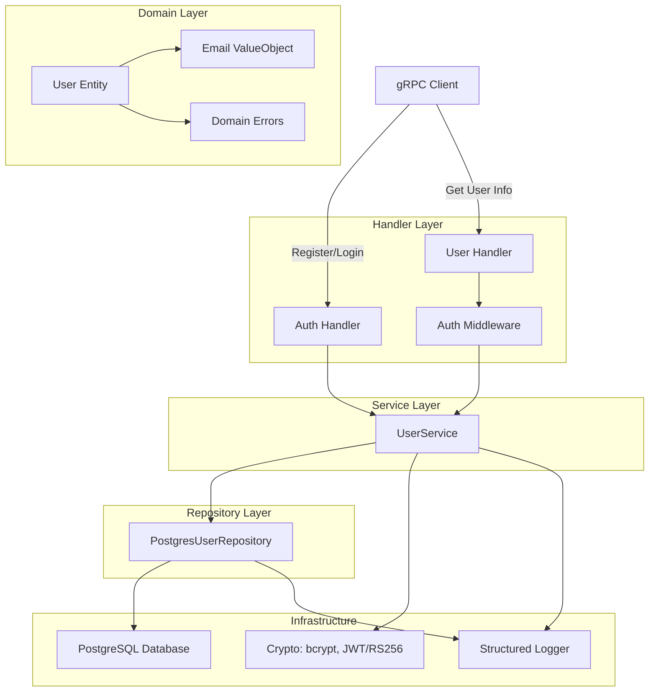
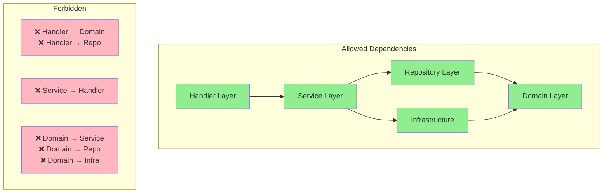
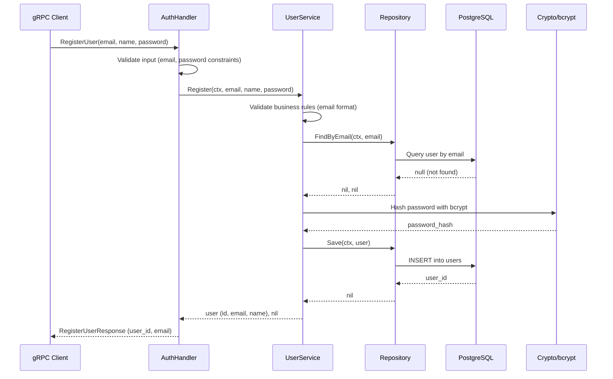
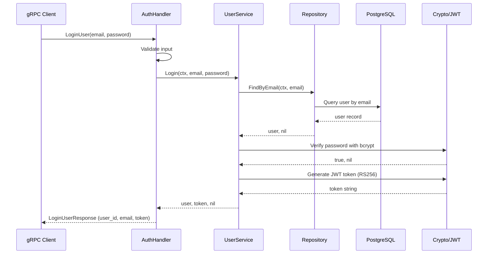
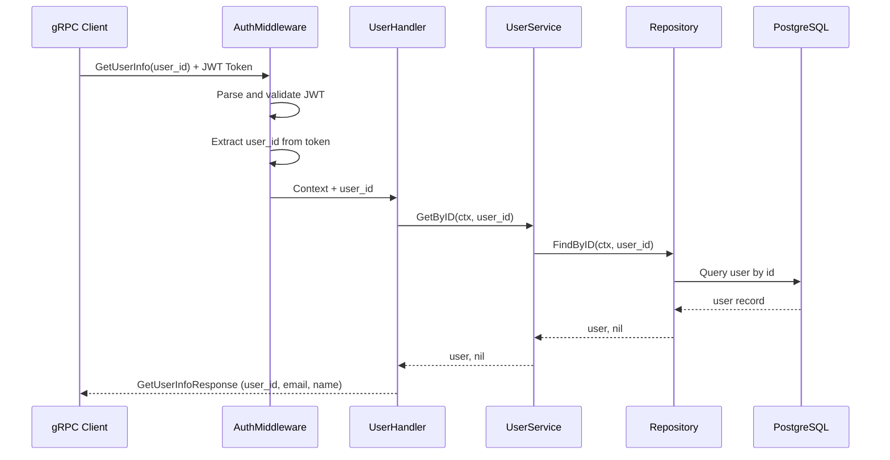
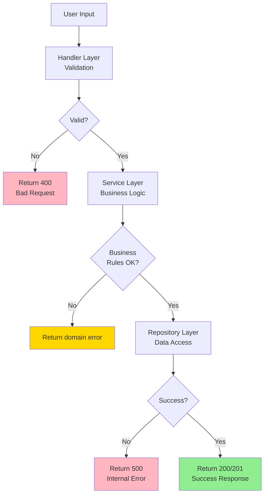
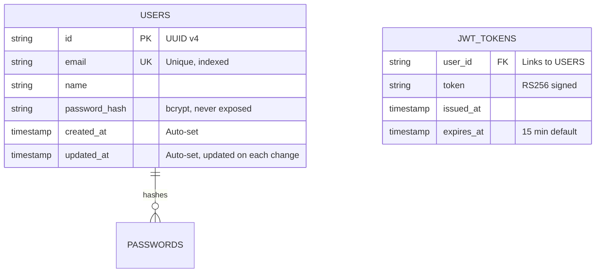
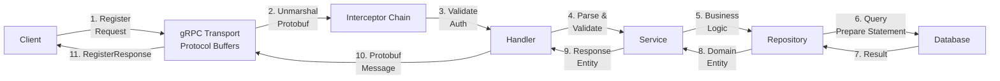
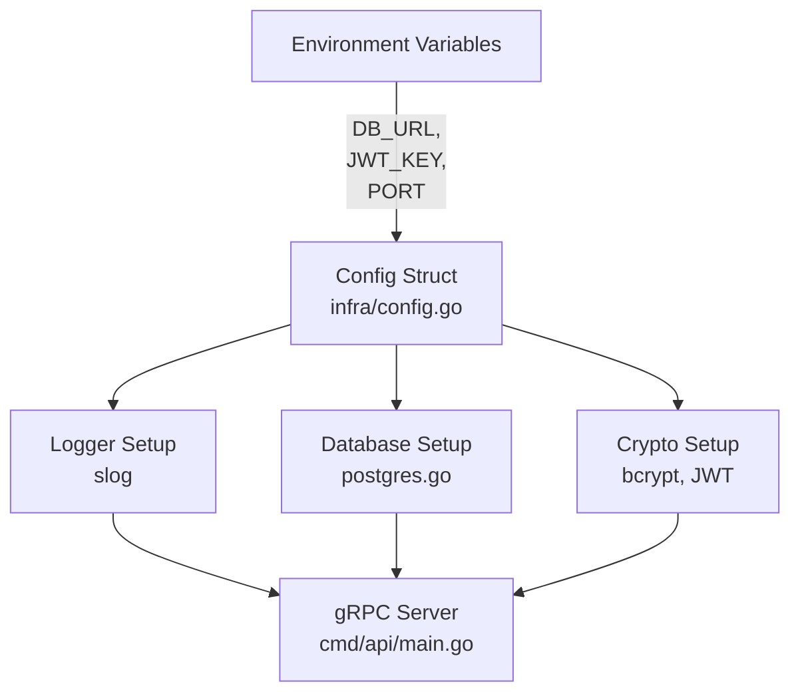

# Architecture: gRPC User Management System

## System Diagram - Layered Architecture



## Dependency Graph



## Registration Flow Sequence



## Login & JWT Generation Flow



## User Info Retrieval with Auth



## Domain Model Class Diagram

```mermaid
classDiagram
    class User {
        +string ID
        +Email Email
        +string Name
        +string PasswordHash
        +time.Time CreatedAt
        +time.Time UpdatedAt
    }

    class Email {
        -string value
        +String() string
        +IsValid() bool
    }

    class UserService {
        +Register(ctx, email, name, password) *User, error
        +Login(ctx, email, password) *User, string, error
        +GetByID(ctx, userID) *User, error
        -validateEmail(email) error
        -validatePassword(password) error
    }

    class UserRepository {
        <<interface>>
        +FindByID(ctx, id) *User, error
        +FindByEmail(ctx, email) *User, error
        +Save(ctx, user) error
    }

    class PostgresUserRepository {
        -db *sql.DB
        -logger *slog.Logger
        +FindByID(ctx, id) *User, error
        +FindByEmail(ctx, email) *User, error
        +Save(ctx, user) error
    }

    class AuthHandler {
        -userService UserService
        -logger *slog.Logger
        +Register(ctx, req) *pb.RegisterResponse, error
        +Login(ctx, req) *pb.LoginResponse, error
    }

    class UserHandler {
        -userService UserService
        -logger *slog.Logger
        +GetUserInfo(ctx, req) *pb.GetUserInfoResponse, error
    }

    class AuthMiddleware {
        -publicKey *rsa.PublicKey
        -logger *slog.Logger
        +ValidateToken(ctx, token) context.Context, error
        +UnaryInterceptor() grpc.UnaryServerInterceptor
    }

    UserService --> UserRepository: "depends on"
    UserService --> Email: "uses"
    AuthHandler --> UserService: "depends on"
    UserHandler --> UserService: "depends on"
    AuthMiddleware --> "validates JWT"
    User --> Email: "contains"
    PostgresUserRepository --> UserRepository: "implements"
```

## Error Handling Flow



## Data Model - Users Table



## Request/Response Flow - gRPC Unary



## Configuration Hierarchy

