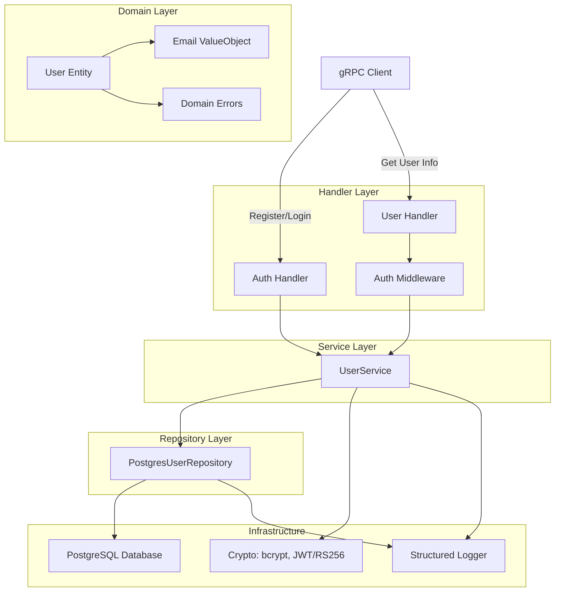
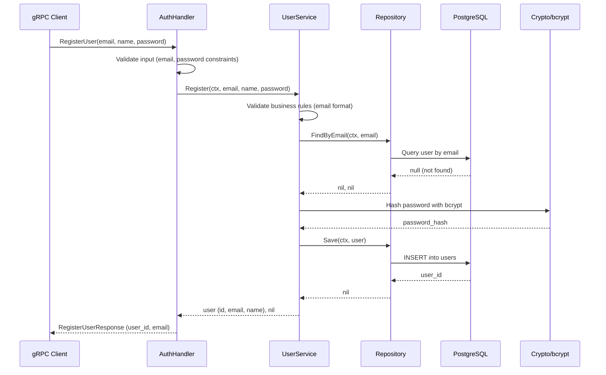
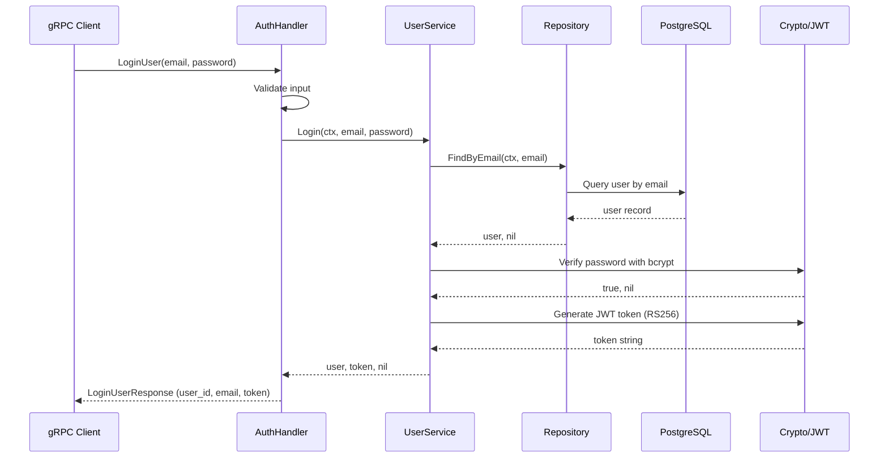
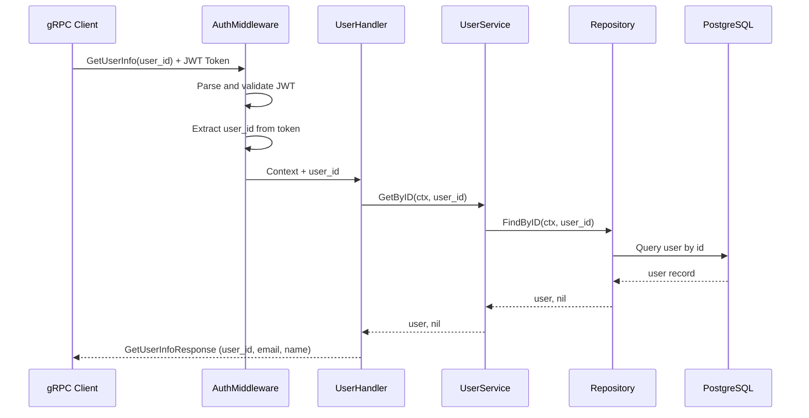

# Feature: gRPC User Management System

## Requirements

### Functional Requirements
- **User Registration**: Allow new users to register with email, name, and password
  - Validate email format and uniqueness
  - Hash password securely (bcrypt)
  - Return user ID and registration status

- **User Login**: Authenticate users and issue JWT tokens
  - Validate email and password
  - Generate JWT token with configurable expiration
  - Return user ID, email, and JWT token

- **View User Information**: Retrieve user profile data
  - Fetch user by ID
  - Return email, name, and user metadata
  - Require authentication (JWT-based)

### Non-Functional Requirements
- **Performance**: < 100ms for registration, login, and info queries (p95)
- **Availability**: Support at least 1000 concurrent users
- **Security**:
  - All passwords hashed with bcrypt (cost ≥ 12)
  - JWT tokens signed with RS256 (asymmetric)
  - Input validation at handler layer
  - Protection against SQL injection
  - Rate limiting on auth endpoints

- **Maintainability**:
  - Clean layered architecture (domain → service → handler)
  - Unit test coverage: domain (90%), service (85%), handler (80%)
  - Integration tests for repository layer

- **Scalability**:
  - Connection pooling for database
  - Prepared statements for all queries
  - Context timeouts for all external calls

### Acceptance Criteria
- All three endpoints functional and tested
- Auth middleware protecting user info endpoint
- Comprehensive test suite with 80%+ coverage
- No hardcoded secrets or credentials
- Proper error handling and logging
- gRPC API specification with protobuf files

## Architecture

### System Diagram



### Sequence Diagram - Registration Flow



### Sequence Diagram - Login & JWT Flow



### Sequence Diagram - Get User Info



### Class/Interface Diagram

```mermaid
classDiagram
    class User {
        +string ID
        +string Email
        +string Name
        +string PasswordHash
        +time.Time CreatedAt
        +time.Time UpdatedAt
    }

    class Email {
        +string value
        +IsValid() bool
    }

    class UserService {
        +Register(ctx, email, name, password) User
        +Login(ctx, email, password) User, string
        +GetByID(ctx, userID) User
        -validateEmail() error
        -validatePassword() error
    }

    class UserRepository {
        +FindByID(ctx, id) User
        +FindByEmail(ctx, email) User
        +Save(ctx, user) error
    }

    class UserHandler {
        +Register(stream) error
        +Login(stream) error
        +GetUserInfo(stream) error
    }

    class AuthMiddleware {
        +ValidateToken(ctx, token) context.Context
        +ExtractUserID(ctx) string
    }

    UserService --> UserRepository: "depends on"
    UserService --> Email: "uses"
    UserHandler --> UserService: "depends on"
    AuthMiddleware --> "validates JWT"
    User --> Email: "contains"
```

## Go Project Layout

```
grpc-user-management/
|
├── cmd/
│   └── api/
│       └── main.go                     # Entry point, gRPC server setup
│
├── internal/
│   ├── domain/
│   │   ├── user.go                     # User entity
│   │   ├── email.go                    # Email value object
│   │   └── errors.go                   # Domain-specific errors
│   │
│   ├── service/
│   │   ├── user_service.go             # User use cases + repo interface
│   │   └── user_service_test.go        # Unit tests
│   │
│   ├── repository/
│   │   ├── user_postgres.go            # PostgreSQL implementation
│   │   └── user_postgres_test.go       # Integration tests
│   │
│   ├── handler/
│   │   ├── auth_handler.go             # Register/Login gRPC handlers
│   │   ├── user_handler.go             # GetUserInfo gRPC handler
│   │   ├── middleware/
│   │   │   └── auth.go                 # JWT validation middleware
│   │   ├── auth_handler_test.go        # Handler unit tests
│   │   ├── user_handler_test.go        # Handler unit tests
│   │   └── middleware_test.go          # Middleware tests
│   │
│   ├── infra/
│   │   ├── postgres.go                 # PostgreSQL connection
│   │   ├── crypto.go                   # bcrypt & JWT utilities
│   │   ├── config.go                   # Configuration & env vars
│   │   └── logger.go                   # Structured logger setup
│   │
│   └── testutil/
│       ├── fixtures.go                 # Test data generators
│       └── mock_repository.go           # Mock for testing
│
├── pkg/
│   ├── validator/
│   │   └── validator.go                # Input validation utilities
│   └── errors/
│       └── errors.go                   # Custom error types
│
├── api/
│   ├── proto/
│   │   ├── user/
│   │   │   ├── v1/
│   │   │   │   ├── user.proto           # Data models
│   │   │   │   └── service.proto        # gRPC service definitions
│   │   └── buf.yaml                    # Protobuf build config
│   └── generated/
│       └── proto/...                   # Generated Go code (auto)
│
├── migrations/
│   ├── 001_create_users.up.sql         # Create users table
│   └── 001_create_users.down.sql       # Rollback migration
│
├── tests/
│   ├── integration/
│   │   ├── user_repo_test.go           # Integration tests
│   │   └── auth_flow_test.go           # End-to-end flow tests
│   └── testdata/
│       └── test_users.json             # Test fixtures
│
├── configs/
│   ├── .env.example                    # Environment template
│   └── config.yaml                     # Config structure
│
├── Makefile                            # Build & test automation
├── go.mod                              # Module definition
├── go.sum                              # Dependency checksums
├── .golangci.yml                       # Linter config
└── README.md                           # Documentation
```

## Task List (Ordered by Priority)

- [ ] **Task 1**: Create domain layer - User entity and Email value object (file: internal/domain/user.go)
- [ ] **Task 2**: Create domain errors (file: internal/domain/errors.go)
- [ ] **Task 3**: Create protobuf definitions for gRPC API (file: api/proto/user/v1/user.proto)
- [ ] **Task 4**: Create protobuf service definitions (file: api/proto/user/v1/service.proto)
- [ ] **Task 5**: Set up infrastructure - PostgreSQL connection (file: internal/infra/postgres.go)
- [ ] **Task 6**: Set up crypto utilities - bcrypt and JWT (file: internal/infra/crypto.go)
- [ ] **Task 7**: Create configuration management (file: internal/infra/config.go)
- [ ] **Task 8**: Create structured logger setup (file: internal/infra/logger.go)
- [ ] **Task 9**: Create UserRepository interface and PostgreSQL implementation (file: internal/repository/user_postgres.go)
- [ ] **Task 10**: Create UserService with business logic (file: internal/service/user_service.go)
- [ ] **Task 11**: Create auth middleware for JWT validation (file: internal/handler/middleware/auth.go)
- [ ] **Task 12**: Create gRPC handlers - AuthHandler (file: internal/handler/auth_handler.go)
- [ ] **Task 13**: Create gRPC handlers - UserHandler (file: internal/handler/user_handler.go)
- [ ] **Task 14**: Create database migrations (files: migrations/001_create_users.up.sql, .down.sql)
- [ ] **Task 15**: Create main.go - dependency injection and server setup (file: cmd/api/main.go)
- [ ] **Task 16**: Create input validator utilities (file: pkg/validator/validator.go)
- [ ] **Task 17**: Write unit tests for UserService (file: internal/service/user_service_test.go)
- [ ] **Task 18**: Write unit tests for Auth handlers (file: internal/handler/auth_handler_test.go)
- [ ] **Task 19**: Write unit tests for User handler (file: internal/handler/user_handler_test.go)
- [ ] **Task 20**: Write unit tests for auth middleware (file: internal/handler/middleware_test.go)
- [ ] **Task 21**: Write integration tests for UserRepository (file: tests/integration/user_repo_test.go)
- [ ] **Task 22**: Write integration/e2e tests for complete auth flow (file: tests/integration/auth_flow_test.go)
- [ ] **Task 23**: Create test fixtures and utilities (file: internal/testutil/fixtures.go)
- [ ] **Task 24**: Set up Makefile with build, test, and dev targets (file: Makefile)
- [ ] **Task 25**: Create README with setup and API documentation (file: README.md)

## Files to Create/Modify

| File | Action | Description |
|------|--------|-------------|
| internal/domain/user.go | CREATE | User entity with ID, Email, Name, PasswordHash, timestamps |
| internal/domain/email.go | CREATE | Email value object with validation logic |
| internal/domain/errors.go | CREATE | Domain errors: ErrInvalidEmail, ErrUserNotFound, ErrUserExists, ErrInvalidPassword |
| api/proto/user/v1/user.proto | CREATE | Protobuf data models: User, Email |
| api/proto/user/v1/service.proto | CREATE | gRPC service definitions: Register, Login, GetUserInfo |
| api/buf.yaml | CREATE | Protobuf build configuration |
| internal/infra/postgres.go | CREATE | PostgreSQL connection pool with proper config |
| internal/infra/crypto.go | CREATE | bcrypt hashing and JWT token generation/validation |
| internal/infra/config.go | CREATE | Configuration struct, env var loading, validation |
| internal/infra/logger.go | CREATE | Structured logger initialization (slog) |
| internal/repository/user_postgres.go | CREATE | PostgresUserRepository with FindByID, FindByEmail, Save |
| internal/service/user_service.go | CREATE | UserService with Register, Login, GetByID use cases |
| internal/handler/middleware/auth.go | CREATE | JWT validation middleware |
| internal/handler/auth_handler.go | CREATE | gRPC handlers: RegisterUser, LoginUser |
| internal/handler/user_handler.go | CREATE | gRPC handler: GetUserInfo |
| internal/testutil/fixtures.go | CREATE | Test data generators and helpers |
| migrations/001_create_users.up.sql | CREATE | CREATE TABLE users with indexes |
| migrations/001_create_users.down.sql | CREATE | DROP TABLE users |
| pkg/validator/validator.go | CREATE | Email, password, name validation utilities |
| cmd/api/main.go | CREATE | gRPC server entry point, DI wiring |
| internal/service/user_service_test.go | CREATE | Unit tests (85% coverage target) |
| internal/handler/auth_handler_test.go | CREATE | Auth handler tests (80% coverage target) |
| internal/handler/user_handler_test.go | CREATE | User handler tests (80% coverage target) |
| internal/handler/middleware_test.go | CREATE | Middleware tests (85% coverage target) |
| tests/integration/user_repo_test.go | CREATE | Integration tests with testcontainers |
| tests/integration/auth_flow_test.go | CREATE | E2E flow tests (80% coverage target) |
| Makefile | CREATE | Build, test, migration targets |
| go.mod | CREATE | Module definition with dependencies |
| go.sum | CREATE | Dependency checksums |
| .golangci.yml | CREATE | Linter configuration |
| configs/.env.example | CREATE | Environment variable template |
| README.md | CREATE | Setup, API docs, testing guide |

## Interface & API Contracts

### Domain Layer Interfaces

```go
// internal/domain/user.go
type User struct {
    ID            string    `json:"id"`
    Email         Email     `json:"email"`
    Name          string    `json:"name"`
    PasswordHash  string    `json:"-"` // never expose
    CreatedAt     time.Time `json:"created_at"`
    UpdatedAt     time.Time `json:"updated_at"`
}

// internal/domain/email.go
type Email struct {
    value string
}

func NewEmail(e string) (Email, error)
func (e Email) String() string
func (e Email) IsValid() bool
```

### Service Layer Interfaces

```go
// internal/service/user_service.go (CONSUMER defines repo interface)

// UserRepository is the interface for user data access
type UserRepository interface {
    FindByID(ctx context.Context, id string) (*domain.User, error)
    FindByEmail(ctx context.Context, email domain.Email) (*domain.User, error)
    Save(ctx context.Context, user *domain.User) error
}

// UserService encapsulates user business logic
type UserService interface {
    Register(ctx context.Context, email, name, password string) (*domain.User, error)
    Login(ctx context.Context, email, password string) (*domain.User, string, error) // (user, jwt_token, error)
    GetByID(ctx context.Context, userID string) (*domain.User, error)
}
```

### Repository Layer Interfaces

```go
// internal/repository/user_postgres.go (PRODUCER returns concrete struct)

type PostgresUserRepository struct {
    db     *sql.DB
    logger *slog.Logger
}

func NewPostgresUserRepository(db *sql.DB, logger *slog.Logger) *PostgresUserRepository

func (r *PostgresUserRepository) FindByID(ctx context.Context, id string) (*domain.User, error)
func (r *PostgresUserRepository) FindByEmail(ctx context.Context, email domain.Email) (*domain.User, error)
func (r *PostgresUserRepository) Save(ctx context.Context, user *domain.User) error
```

### gRPC Service Definition

```protobuf
// api/proto/user/v1/service.proto

service UserService {
  rpc Register(RegisterRequest) returns (RegisterResponse);
  rpc Login(LoginRequest) returns (LoginResponse);
  rpc GetUserInfo(GetUserInfoRequest) returns (GetUserInfoResponse);
}

message RegisterRequest {
  string email = 1;
  string name = 2;
  string password = 3;
}

message RegisterResponse {
  string user_id = 1;
  string email = 2;
  string name = 3;
}

message LoginRequest {
  string email = 1;
  string password = 2;
}

message LoginResponse {
  string user_id = 1;
  string email = 2;
  string token = 3; // JWT token
}

message GetUserInfoRequest {
  string user_id = 1;
}

message GetUserInfoResponse {
  string user_id = 1;
  string email = 2;
  string name = 3;
}
```

### HTTP/gRPC Handler Interfaces

```go
// internal/handler/auth_handler.go
type AuthHandler struct {
    userService service.UserService
    logger      *slog.Logger
}

func NewAuthHandler(userService service.UserService, logger *slog.Logger) *AuthHandler

func (h *AuthHandler) Register(ctx context.Context, req *pb.RegisterRequest) (*pb.RegisterResponse, error)
func (h *AuthHandler) Login(ctx context.Context, req *pb.LoginRequest) (*pb.LoginResponse, error)

// internal/handler/user_handler.go
type UserHandler struct {
    userService service.UserService
    logger      *slog.Logger
}

func NewUserHandler(userService service.UserService, logger *slog.Logger) *UserHandler

func (h *UserHandler) GetUserInfo(ctx context.Context, req *pb.GetUserInfoRequest) (*pb.GetUserInfoResponse, error)
```

### Middleware Interfaces

```go
// internal/handler/middleware/auth.go
type AuthMiddleware struct {
    publicKey *rsa.PublicKey
    logger    *slog.Logger
}

func NewAuthMiddleware(publicKey *rsa.PublicKey, logger *slog.Logger) *AuthMiddleware

func (m *AuthMiddleware) ValidateToken(ctx context.Context, token string) (context.Context, error)
func (m *AuthMiddleware) UnaryInterceptor() grpc.UnaryServerInterceptor
```

## Design Patterns

| Pattern | Where | Why |
|---------|-------|-----|
| **Repository** | service/ → repository/ | Data access abstraction, testability via mocks |
| **Middleware** | handler/middleware/ | JWT auth without polluting business logic |
| **Constructor Injection** | All layers | Dependency management, testability |
| **Value Object** | domain/email.go | Encapsulate email validation, type safety |
| **Factory** | crypto utilities | Token generation, password hashing factory |
| **Error Wrapping** | All layers | Context-preserving error handling (fmt.Errorf %w) |

**Patterns NOT used (per Go idioms)**:
- No generic interfaces (Go's small interface approach)
- No abstract base classes (composition over inheritance)
- No event-driven architecture (not needed for CRUD operations)

## Test Plan

| Module | Test Type | Coverage Target | Key Test Cases |
|--------|-----------|-----------------|----------------|
| domain/ | Unit | 90% | Email validation (valid, invalid, edge cases), User creation |
| service/ | Unit | 85% | Register (success, duplicate email, invalid password), Login (success, wrong password, user not found), GetByID (success, user not found) |
| repository/ | Integration | 70% | CRUD operations with real PostgreSQL, error handling, transaction rollback |
| handler/ | Unit | 80% | Request parsing, validation errors, successful responses, malformed JSON |
| middleware/ | Unit | 85% | Valid JWT, invalid JWT, missing token, expired token, token extraction |
| Critical paths (auth) | Unit + Integration | 95% | Full registration → login → get info flow |

### Test Coverage by Module

```
domain/:           90%+ (Email validation, User creation)
service/:          85%+ (Use cases: Register, Login, GetByID with mocks)
repository/:       70%+ (PostgreSQL integration with testcontainers)
handler/:          80%+ (Request/response parsing, validation)
middleware/:       85%+ (JWT validation, token extraction)
Overall target:    80%+ project-wide
```

### Key Test Scenarios

**Registration Tests**:
- Valid registration with unique email
- Duplicate email rejection
- Invalid email format rejection
- Weak password rejection
- Missing fields rejection

**Login Tests**:
- Successful login returns JWT token
- Wrong password rejection
- User not found rejection
- Expired token handling

**User Info Tests**:
- Authenticated user can get own info
- Unauthenticated request rejected
- Invalid user ID handling
- Missing authentication token rejection

**Middleware Tests**:
- Valid JWT token accepted
- Expired JWT token rejected
- Invalid signature rejection
- Missing token rejected
- User ID correctly extracted from token

## Security Considerations

### OWASP A03: Injection Prevention
- **Mitigation**: Use parameterized queries (sql.DB with placeholders)
- **Implementation**: All repository methods use `?` placeholders
- **Verification**: Code review to ensure no string concatenation in SQL

### OWASP A07: Authentication Failures
- **Mitigation**:
  - Bcrypt with cost ≥ 12 for passwords
  - RS256 (asymmetric) for JWT signing
  - Token expiration (15 minutes access, 7 days refresh)
  - Validate JWT algorithm (prevent "none" attack)
- **Implementation**: crypto/crypto.go with proper config
- **Verification**: Integration tests verify password validation

### OWASP A01: Broken Access Control
- **Mitigation**:
  - Auth middleware validates JWT on protected endpoints
  - Extract user_id from token claims
  - Compare user_id in request with token claims
- **Implementation**: middleware/auth.go UnaryInterceptor
- **Verification**: Test unauthorized access rejection

### Input Validation (OWASP A04)
- **Mitigation**:
  - Validate email format at handler layer
  - Validate password length (min 8, max 72 for bcrypt)
  - Validate name length (min 2, max 255)
  - Reject unknown fields in JSON
- **Implementation**: pkg/validator/validator.go
- **Verification**: Handler unit tests verify rejection of invalid inputs

### Rate Limiting
- **Mitigation**: Implement token bucket rate limiter on auth endpoints
- **Implementation**: grpc middleware with per-IP rate limit
- **Config**: Max 5 requests per minute per IP on register/login

### Secrets Management
- **Mitigation**:
  - No hardcoded keys, passwords, or tokens
  - Use environment variables for:
    - Database credentials
    - JWT signing/verification keys
    - Password hashing cost parameter
    - API port and host
- **Implementation**: infra/config.go loads from .env
- **Verification**: Code review, no secrets in codebase

### Logging Security
- **Mitigation**:
  - Never log passwords or tokens
  - Never log full request bodies
  - Log auth events (register, login, unauthorized access)
  - Include request ID for traceability
- **Implementation**: Structured logging with slog, explicit field selection
- **Verification**: Code review of log statements

### Data Protection
- **Mitigation**:
  - Passwords always hashed (never stored plaintext)
  - JWT tokens used instead of session IDs (stateless)
  - SQL prepared statements prevent injection
- **Implementation**: Service layer validates, infra layer hashes
- **Verification**: Repository and crypto tests

### Error Handling
- **Mitigation**:
  - Don't expose internal errors to clients
  - Use domain errors with generic messages
  - Log detailed errors internally
- **Implementation**: Handler converts domain errors to gRPC codes
- **Verification**: Handler tests verify error responses

## Risks & Mitigations

| Risk | Impact | Likelihood | Mitigation |
|------|--------|-----------|-----------|
| Password hashing too weak (bcrypt cost < 12) | High - passwords cracked | Medium | Config validation enforces cost ≥ 12, code review |
| JWT secret exposed in code | Critical - token forgery possible | Medium | Load from env vars, .gitignore config files |
| SQL injection via user input | High - data breach | Low | Parameterized queries, validator tests |
| Race condition on duplicate email registration | Medium - inconsistent state | Low | Database UNIQUE constraint + check at service |
| Database connection pool exhaustion | High - service unavailable | Low | Set max connections, timeouts on all queries |
| gRPC streaming state not cleaned up | Medium - resource leak | Low | Context cancellation, defer cleanup in handlers |
| Missing JWT expiration validation | High - token never expires | Medium | Code review, middleware tests verify exp claim |
| Concurrency issues in crypto operations | Medium - wrong tokens generated | Low | Use crypto/rand, crypto/rsa (both thread-safe) |
| Missing context cancellation in goroutines | Medium - resource leak | Medium | Every goroutine checks ctx.Done(), unit tests with race detector |
| Passwords logged accidentally | Critical - credential exposure | Low | Code review, structured logging with explicit fields |

---

## Implementation Notes

1. **Protobuf Code Generation**:
   - Use `protoc` with Go plugin or `buf` CLI
   - Generate Go code to `api/generated/` (auto-excluded from git)
   - Re-generate before each build

2. **Database Migrations**:
   - Use golang-migrate or goose
   - Run migrations on startup
   - Include proper indexes on email and id fields

3. **Testing Strategy**:
   - Unit tests mock all external dependencies
   - Integration tests use testcontainers for PostgreSQL
   - Run with `-race` flag to catch concurrency issues

4. **Dependency Injection**:
   - All wiring in cmd/api/main.go
   - Constructor functions for each component
   - No global variables or init() for setup

5. **Configuration Management**:
   - .env.example shows required variables
   - Config struct with validation
   - Separate configs not needed (env vars handle env-specific values)

6. **Logging**:
   - Use slog (Go 1.21+ standard)
   - Include request ID in context
   - Log levels: Debug (dev), Info (events), Warn (issues), Error (failures)

7. **Error Handling**:
   - Domain errors for business logic violations
   - Wrap with context using fmt.Errorf("%w", err)
   - Handler converts to appropriate gRPC codes